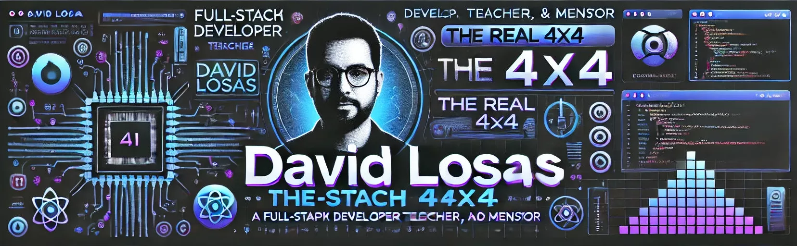

# 

  <i>📌 Esta imagen fue generada con IA. Si ves alguna falta de ortografía, no es culpa mía... ¡la IA aún tiene cosas que aprender! 😆</i>

## 🚀 David Losas González | Full Stack JavaScript Developer | React · Node.js · SQL

Desde 2019 he estado involucrado en más de 30 bootcamps como Coordinador Técnico en HACK A BOSS, formando a más de 200 futuros desarrolladores en tecnologías como HTML, CSS, JavaScript, SQL, Node.js y React. Durante estos años he revisado y optimizado más de 50 proyectos, aportando valor desde la resolución de bugs hasta la implementación de clean code y estructuras escalables.

Además de enseñar, desarrollo activamente: programo, mantengo y refactorizo código a diario. Tuve la oportunidad de participar en el desarrollo inicial de Twoller, una startup del sector travel-tech, aplicando el stack JavaScript en un entorno de producto real.

Actualmente, estoy consolidando mis habilidades con Redux, Next.js, Nest.js y pruebas automatizadas con Jest y Testing Library.

Me caracterizo por ser proactivo, resolutivo y autónomo, con capacidad de análisis y toma de decisiones técnicas fundamentadas. Me caracterizo por ser proactivo, resolutivo y autónomo, con capacidad de análisis y toma de decisiones técnicas fundamentadas. ¿Se puede pedir más?

## 💻 Stack Tecnológico

### 💬 Lenguajes

### 🎨 Frontend

### 🔥 Backend & APIs

### 🛢️ Bases de Datos & ORM

### 🧪 Testing

### ⚙️ Herramientas & Control de Versiones

## 🌟 Aptitudes y Habilidades

-   **Docencia y Mentoría:** Más de 30 bootcamps impulsando el talento de futuros desarrolladores.
-   **Comunicación:** Capacidad para transmitir ideas de forma clara y efectiva.
-   **Facilidad de Adaptación:** Rápido aprendizaje y adaptación a nuevos entornos y tecnologías.

## 🏆 Experiencia

-   **Coordinador Técnico en HACK A BOSS (desde 2019)**  
    Más de 30 bootcamps en tecnologías web y programación, ayudando a transformar jóvenes talentos en desarrolladores profesionales.

## 📫 Contacto

Si quieres conectar puedes encontrarme en [LinkedIn](https://www.linkedin.com/in/david-losas-gonzalez).
